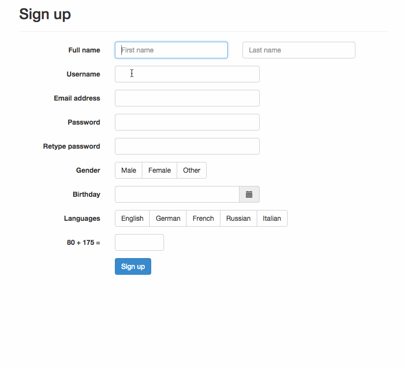

# BootstrapValidator - [v0.5.2](http://bootstrapvalidator.com/getting-started/#download)

[http://bootstrapvalidator.com](http://bootstrapvalidator.com) - The best jQuery plugin to validate form fields, designed to use with [Bootstrap 3](http://getbootstrap.com).

It's developed from scratch by [@nghuuphuoc](http://twitter.com/nghuuphuoc).

__Required__: [jQuery](http://jquery.com/) and [Bootstrap 3](http://getbootstrap.com/)



## [Help the project](https://pledgie.com/campaigns/24885)

I've been spending a lot of time to work on this plugin. If it is useful to you, please consider to help the project by making a small donation:

<a href="https://pledgie.com/campaigns/24885"></a>

Also, you can make me feel happy by [tweeting](https://twitter.com/intent/tweet?hashtags=javascript,jquery,twbootstrap&original_referer=http://github.com/nghuuphuoc/bootstrapvalidator&text=BootstrapValidator%20is%20the%20best%20jQuery%20plugin%20to%20validate%20form%20fields&url=http://bootstrapvalidator.com) about it and [staring](https://github.com/nghuuphuoc/bootstrapvalidator/stargazers) the project on Github.

## Live demo

http://bootstrapvalidator.com/examples/

There are also many examples located in the [demo](demo) directory.

You also can run the ```demo``` locally by:

* Clone the repo: ```git clone https://github.com/nghuuphuoc/bootstrapvalidator.git```
* Go to the cloned directory and run the command: ```python -m SimpleHTTPServer 8000```
* Access the demo at ```http://localhost:8000/demo/the_demo_file_here.html```

## Features

See [official website](http://bootstrapvalidator.com) for the full list of features

## Download

* Latest version: [v0.5.2](http://bootstrapvalidator.com/getting-started/#download), released on 2014-09-25
* For older versions, look at the [Releases](https://github.com/nghuuphuoc/bootstrapvalidator/releases) page
* Release History: Look at the [Change Log](CHANGELOG.md)

## Documentation

* [Official website](http://bootstrapvalidator.com)
* [Official website source](https://github.com/nghuuphuoc/bootstrapvalidator/tree/docs)

## Author

The __BootstrapValidator__ plugin is written by Nguyen Huu Phuoc, aka @nghuuphuoc

* [http://twitter.com/nghuuphuoc](http://twitter.com/nghuuphuoc)
* [http://github.com/nghuuphuoc](http://github.com/nghuuphuoc)

Big thanks to the [contributors](CONTRIBUTORS.md).

```
The MIT License (MIT)

Copyright (c) 2013 - 2014 Nguyen Huu Phuoc

Permission is hereby granted, free of charge, to any person obtaining a copy of
this software and associated documentation files (the "Software"), to deal in
the Software without restriction, including without limitation the rights to
use, copy, modify, merge, publish, distribute, sublicense, and/or sell copies of
the Software, and to permit persons to whom the Software is furnished to do so,
subject to the following conditions:

The above copyright notice and this permission notice shall be included in all
copies or substantial portions of the Software.

THE SOFTWARE IS PROVIDED "AS IS", WITHOUT WARRANTY OF ANY KIND, EXPRESS OR
IMPLIED, INCLUDING BUT NOT LIMITED TO THE WARRANTIES OF MERCHANTABILITY, FITNESS
FOR A PARTICULAR PURPOSE AND NONINFRINGEMENT. IN NO EVENT SHALL THE AUTHORS OR
COPYRIGHT HOLDERS BE LIABLE FOR ANY CLAIM, DAMAGES OR OTHER LIABILITY, WHETHER
IN AN ACTION OF CONTRACT, TORT OR OTHERWISE, ARISING FROM, OUT OF OR IN
CONNECTION WITH THE SOFTWARE OR THE USE OR OTHER DEALINGS IN THE SOFTWARE.
```
